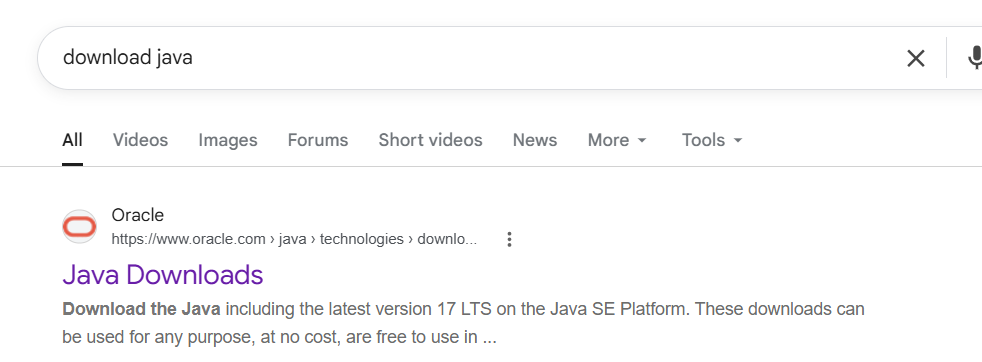

# Kotlin Installation

Kotlin requires Java. So, install first Java.


Download Java



### Search "Download Java"

<figure><figcaption></figcaption></figure>



### Click on this link

[https://www.oracle.com/java/technologies/downloads/](https://www.oracle.com/java/technologies/downloads/)



### Scroll down, Select Java 17 &&#x20;





Download its Windows X86 Version



### Check whether installed or not


```
java --version
```


<mark style="color:$warning;">java 17.0.12 2024-07-16 LTS</mark>
\ <mark style="color:$warning;">Java(TM) SE Runtime Environment (build 17.0.12+8-LTS-286)</mark>
\ <mark style="color:$warning;">Java HotSpot(TM) 64-Bit Server VM (build 17.0.12+8-LTS-286, mixed mode, sharing)</mark>



### Now, Install Kotlin


### SOURCES:

[https://www.youtube.com/watch?v=Z4HbPJyPQu8](https://www.youtube.com/watch?v=Z4HbPJyPQu8)


